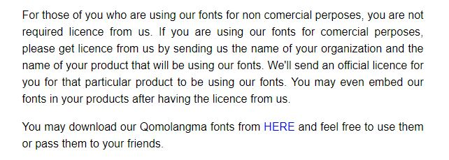

# Yalasoo-Qomolangma-Tibetan-fonts

source: http://www.yalasoo.com/English/docs/yalasoo_en_qomolangma_fonts_COM.html

An archive of Qomolangma Tibetan fonts.

`@import url(https://victorlee.github.io/Yalasoo-Qomolangma-Tibetan-fonts/stylesheet.css);`

[stylesheet.css](stylesheet.css)

- `Qomolangma-Betsu`
- `Qomolangma-Chuyig`
- `Qomolangma-Art`
- `Qomolangma-Drutsa`
- `Qomolangma-Dunhuang`
- `Qomolangma-Edict`
- `Qomolangma-Horyig`
- `Qomolangma-Subtitle`
- `Qomolangma-Title`
- `Qomolangma-Tsumachu`
- `Qomolangma-Tsuring`
- `Qomolangma-Tsutong`
- `Qomolangma-Uchen Sarchen`
- `Qomolangma-Uchen Sarchung`
- `Qomolangma-Uchen Suring`
- `Qomolangma-Uchen Sutung`
- `Qomolangma-Woodblock`
